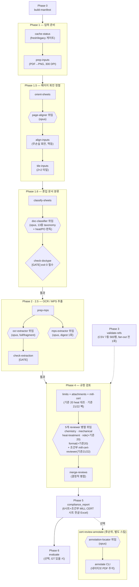

# ReportReviewer

파이프 자재 **MTC(Mill Test Certificate / 성적서) 자동 검토** Claude Code 플러그인.

스캔된 성적서 PDF를 **Claude Vision으로 OCR**하고, **MPS(구매시방서)** 및 **ASTM/ASME 코드** 기준값과 대조하여 PASS/FAIL/지적사항을 판정, **6시트(+조건부 원자재 MILL CERT 시트) 한글 Excel 리포트**를 생성한다. 모든 기준값은 ref_code/MPS 원문에서 인용하며(출처 3종 메타 검증) **LLM이 기준값을 생성하지 않는다**.

> 사내 전용(Proprietary). [LICENSE](LICENSE) 참조.

> **최신 버전 v1.8.0** — 주석 직전 페이지 업라이트 정규화 전처리 추가(회전 페이지를 무손실 회전 matrix 전사로 `/Rotate=0` 정규화 후 주석 부착 — Acrobat 핸들 UI 불일치의 전제 제거). 전체 변경 이력은 [`docs/revision_history.md`](docs/revision_history.md) 참조.

## 핵심 특징

- **2차원 병렬 아키텍처**: 오케스트레이터(SKILL.md)가 케이스 × 도메인 에이전트를 직접 스케줄링 (동시 6~10). 케이스 래퍼 에이전트 없음 — 서브에이전트는 중첩 스폰 불가이므로 모든 fan-out을 오케스트레이터가 직접 수행한다.
- **역할 분리 서브에이전트**: 페이지 정렬 전용(`page-aligner`) + OCR 전용(`ocr-extractor`, claude-opus-5) + MPS 추출 전용(`mps-extractor`, claude-opus-5) + 도메인별 검토 5종 + 조건부 원자재 MILL CERT 검증 1종(`claude-opus-5`) — 방향 감지·전사(판독)·MPS 추출·판정을 역할로 분리.
- **OCR 이전 페이지 회전 자동 정렬(Phase 1.5)**: 스캔이 페이지별로 회전 혼재된 파일도 컨택트시트 기반 감지(`orient-sheets`→`page-aligner`)와 결정적 무손실 회전(`align-inputs`, 멱등)으로 타일링 전에 정방향 교정. crop/annotate도 동일 적용 맵을 참조해 좌표계 일관 유지.
- **혼입 문서 페이지 분류·제외(Phase 1.6)**: 접수 PDF에 완제품 성적서 외 문서(원자재 Mill Cert, PMI/NDE/외관치수/이화학/조직시험 보고서, 열처리로 온도차트 등)가 섞여 들어와도 전담 에이전트 `doc-classifier`가 페이지 단위로 13종 taxonomy 분류, 결정적 게이트(`check-doctype`)를 통과해야 OCR로 진행한다. 판정 권위는 `<stem>_doctype.json` sidecar 하나이며 whitelist 방식(부재/미지 라벨은 안전하게 검토 포함)으로 하위호환을 보장한다.
- **MPS 요구 대비 동봉 문서 첨부 자동판정(기준 20)**: doc-classifier가 제외 문서의 Heat No./P.O NO.를 verbatim 판독하고, 결정적 CLI `attachments`가 완제품 heat 인벤토리와 정규화 완전일치로 대조한다. 판정은 A(본문 인쇄값 우선)/B(요구+미첨부→ActionRequired 상한)/C(요구+첨부 확인→PASS)/D(첨부 있으나 heat 불확실→Question) 4단계 우선순위 사다리로, 미첨부 단독으로는 Reject하지 않고 요구 없는 첨부는 finding을 내지 않는다(과잉판정 방지).
- **동봉 원자재 성적서(MILL CERT) 검증·교차비교(기준 21/22)**: `MTC_RAW_MATERIAL` 페이지는 전사 예외로 전량 전사되고, 결정적 CLI `mill-cert`가 연결성(Heat/MILL CERT NO./grade 계열)·단조 술어·인장 동일성 상태기계·화학 공통원소 비교를 산출한다. 조건부 전담 에이전트 `mill-cert-reviewer`가 화학성분 불일치는 원소별 '주의', **단조품 인장값이 MILL CERT와 소수점까지 전부 동일하면 FAIL**(완제품 시험 미실시·전사 복제 의심)로 판정한다. 화학성분 '동일'은 정상(제강사 성적 인용 관행) — 인장 '동일'만 위반.
- **결정적 병합 단계**: 검토 5에이전트(+선택적 mill_cert)가 각자 부분 산출물을 쓰고, `merge-reviews` CLI가 전역 재채번 및 verdict 최악값으로 결정적 병합. 하류 Phase 5/6 계약 불변.
- **Claude Vision OCR 강제**: Python OCR 라이브러리 일체 미사용 (`pytesseract`/`easyocr`/`pymupdf` 등 금지, AST 회귀로 검증). PDF는 `pypdfium2`로 페이지를 렌더링하고, `pypdf`는 출처 검증용 임베디드 텍스트 추출에만 쓴다
- **출처 강제(provenance)**: 모든 판정 근거에 `source_file`/`anchor`/`snippet` 3종 메타. 미검증 근거는 자동 격리
- **단일 OCR 입력 채널**: cert 본문을 Claude Vision으로 전사하는 `channels.body` 하나만 사용한다. 입력은 3개 카테고리(① 참조 코드 ② 성적서 ③ MPS) 폴더로 인식하며, 이메일(.msg)·zip 첨부·PDF 주석을 입력 채널로 받지 않는다(원본 reviewer 주석은 입력 가드로 차단).
- **6시트(+조건부 1시트) 한글 리포트**: 검토 총괄 / 화학성분 / 기계적성질 / 열처리 / 표기·형식 / (조건부) 원자재 MILL CERT 검토 / 지적사항 종합
- **검토 결과 PDF 주석(별도 스킬 `cert-review-annotate`)**: 검토 후 후순위 단계로 주의/N/A/FAIL 판정(PASS 제외)을 원본 cert PDF에 **네이티브 PDF 주석 오브젝트**로 부착 — 테두리 사각형(/Square, 채우기 없음)+Acrobat 네이티브 빈 팝업 스레드+50자 한글 라벨(/FreeText, 자체 /AP로 전 뷰어 상시 표시). 전 페이지 원본 보존(콘텐츠 무변경), 주석은 뷰어에서 개별 삭제·이동·수정 가능. 좌표는 전용 `annotation-locator` 에이전트가 review.json에서 산출하고 색은 리포트와 동일하며, cert-review 검토 로직은 무수정

## 전체 파이프라인 (작업 순서도)

Phase 0~6 전체 흐름. 사각형=결정적 CLI(Python), 육각형=Claude Vision 에이전트 위임, 마름모=게이트(실패 시 다음 단계 진행 금지).



각 단계의 정확한 CLI 명령은 아래 "사용" 절, 상세 절차 서술은 [`skills/cert-review/SKILL.md`](skills/cert-review/SKILL.md) 참조.

## 설치

### 1) Claude Code 플러그인으로 등록 (마켓플레이스)

```
/plugin marketplace add git@github.com:Donghun1q2w/ReportReviewer.git
/plugin install cert-review@ReportReviewer
```

### 2) Python 런타임 의존성

```powershell
pip install -r requirements.txt
```

## 사용

플러그인 설치 후 Claude Code 세션에서:

```
/cert-review                # 작업 폴더의 3개 카테고리 입력(참조코드·성적서·MPS)을 검토
/cert-review-annotate       # 위 검토 후, 결과(주의/N/A/FAIL)를 원본 PDF에 주석으로 표기
# (`--all` / `<case_id>` 형태의 케이스 선택은 플러그인 테스트 하니스 회귀 전용)
```

> `cert-review`·`cert-review-annotate` 두 스킬은 같은 플러그인에 포함되어 한 번의 설치로 함께 제공된다.

또는 Python CLI를 직접 실행 (Windows PowerShell):

```powershell
cd skills/cert-review
$env:PYTHONIOENCODING="utf-8"
$env:CERT_REVIEW_WORKDIR="<성적서/MPS/ref_code가 있는 작업 폴더>"
python -m scripts.cli build-manifest            # Phase 0: cert/MPS 인덱스
python -m scripts.cli validate-refs             # Phase 3: CSV 출처 검증 (fan-out 전 1회)
python -m scripts.cli cache-status --case <id>  # Phase 1: 캐시 게이트 (fresh/legacy면 OCR 스킵)
python -m scripts.cli prep-inputs --case <id>   # Phase 1: cert PDF→PNG (300 DPI)
python -m scripts.cli orient-sheets --case <id> # Phase 1.5: 방향 감지용 컨택트시트 (page-aligner 입력)
#  -> page-aligner 위임: 시트 판독→<stem>_orientation.json (페이지별 0/90/180/270)
python -m scripts.cli align-inputs --case <id>  # Phase 1.5: 감지 회전각 적용(무손실·멱등) + <stem>_alignment.json
python -m scripts.cli tile-inputs --case <id>   # Phase 1: 페이지 PNG→2×2 중첩 타일 (ocr-extractor 판독 입력)
python -m scripts.cli classify-sheets --case <id>  # Phase 1.6: 정립 시트 합성 (doc-classifier 입력)
#  -> doc-classifier(claude-opus-5) 위임: 시트 판독→<stem>_doctype.json (13종 taxonomy + related heat/PO)
python -m scripts.cli check-doctype --case <id> # Phase 1.6: 분류 게이트 (exit 0 필수 — 통과 전 OCR 금지)
python -m scripts.cli prep-mps   --case <id>    # Phase 1: MPS PDF→PNG+타일 (mps-extractor 입력)
#  -> ocr-extractor + mps-extractor(claude-opus-5) 병렬 위임 (SKILL.md Phase 2)
#     ocr-extractor: tiles 판독→<stem>_extracted.json (>6p는 fragment 위임 후 merge-parts)
#     mps-extractor: mps_tiles 1회 추출→<case>_mps_digest.json (검토 5에이전트 공유)
python -m scripts.cli check-extraction --case <id>  # Phase 2.5: 완전성 게이트 (통과 전 검토 금지)
python -m scripts.cli attachments --case <id>   # Phase 4: 기준 20 첨부 대조 (heat 정규화 완전일치)
python -m scripts.cli mill-cert --case <id>     # Phase 4: 기준 21/22 MILL CERT 교차비교 팩 (런 0건도 exit 0)
#  -> limits + attachments + mill-cert 조회 후 chemistry/mechanical/heat-treatment/nde/format-reviewer
#     (+ applicable 케이스는 mill-cert-reviewer 조건부) 병렬 위임 (Phase 4)
python -m scripts.cli merge-reviews --case <id> # 부분 산출 결정적 병합 (excluded_documents[] 포함)
python -m scripts.cli evaluate --all            # Phase 6: GT 평가(있을 시)
```

전체 절차(Phase 0~6)는 [`skills/cert-review/SKILL.md`](skills/cert-review/SKILL.md) 참조.

### 작업 폴더 레이아웃 / 환경변수

런타임은 작업 디렉토리를 다음 우선순위로 찾는다: `CERT_REVIEW_WORKDIR` → (testbed 자동감지) → 현재 디렉토리(CWD).

입력 폴더명은 환경변수로 재정의 가능 (기본값은 standard-inspection 데이터셋 레이아웃):

| 환경변수 | 기본값 |
|---|---|
| `CERT_REVIEW_WORKDIR` | (CWD) |
| `CERT_REVIEW_CERT_DIR` | `standard inspection Cert cleanup data` |
| `CERT_REVIEW_MPS_DIR` | `standard inspection MPS cleanup data` |
| `CERT_REVIEW_RAWDATA_DIR` | `rawdata` |
| `CERT_REVIEW_REF_CODE_DIR` | `ref_code` |

## 저장소 구조

```
ReportReviewer/
├── .claude-plugin/marketplace.json   # 플러그인 마켓플레이스 매니페스트
├── agents/                           # 플러그인 서브에이전트 (frontmatter model 포함)
│   ├── page-aligner.md               # Phase 1.5 페이지 회전 감지 (claude-opus-5) → <stem>_orientation.json
│   ├── doc-classifier.md             # Phase 1.6 혼입 문서 페이지 분류 (claude-opus-5) → <stem>_doctype.json
│   ├── ocr-extractor.md              # Phase 2 Vision 전사 (claude-opus-5, full/fragment 모드)
│   ├── mps-extractor.md              # Phase 4 직전 MPS 스캔 1회 추출 (claude-opus-5) → <case>_mps_digest.json
│   ├── chemistry-reviewer.md         # Phase 4 화학성분 검토 (claude-opus-5)
│   ├── mechanical-reviewer.md        # Phase 4 기계적 성질 검토 (claude-opus-5)
│   ├── heat-treatment-reviewer.md    # Phase 4 열처리 검토 (claude-opus-5)
│   ├── nde-reviewer.md               # Phase 4 NDE/특별요구 검토 + 기준 20 PMI/NDE/조직 첨부판정 (claude-opus-5)
│   ├── format-reviewer.md            # Phase 4 문서·식별·인쇄기준 검토 + 기준 20 나머지 4종 첨부판정 (claude-opus-5)
│   ├── mill-cert-reviewer.md         # Phase 4 원자재 MILL CERT 검증·교차비교 (기준 21·22, 조건부) (claude-opus-5)
│   └── annotation-locator.md         # (cert-review-annotate) review.json→주석 좌표 산출 (claude-opus-5)
├── skills/cert-review/
│   ├── SKILL.md                      # Claude 오케스트레이션 절차서 (Phase 0~6)
│   ├── scripts/                      # 결정적 Python 모듈 (CLI/엔진/평가)
│   │   ├── orient_sheets.py          # Phase 1.5/1.6 방향감지·문서분류용 컨택트시트 합성 (page-aligner/doc-classifier 입력)
│   │   ├── align_inputs.py           # Phase 1.5 회전 적용 (2단계 커밋, 멱등·크래시-세이프)
│   │   ├── doctype.py                # Phase 1.6 taxonomy 단일소스·check-doctype 게이트·excluded_documents[] 산출
│   │   ├── attachments.py            # 기준 20 결정적 heat 대조 (완전일치, unmatched 분리, 자동 FAIL 금지)
│   │   ├── mill_cert.py              # 기준 21/22 결정적 교차비교 팩 (연결성·단조 술어·인장 상태기계·화학 공통원소)
│   │   ├── merge_reviews.py          # 검토 5에이전트(+선택적 mill_cert) 부분 산출 결정적 병합 (excluded_documents[] 포함)
│   │   ├── annotate_pdf.py           # (cert-review-annotate) 네이티브 PDF 주석 생성 (Square+Popup+FreeText 자체 /AP)
│   │   └── ...
│   ├── data/*.csv                    # 참조 기준값 7종 (출처 3종 메타 검증)
│   ├── references/                   # review-criteria(기준 20·21·22 포함) / conventions / extraction-schema
│   └── tests/                        # 280개 단위 테스트 (test_doctype.py·test_attachments.py·test_mill_cert.py 등 포함)
├── skills/cert-review-annotate/      # 주석 표기 스킬 (cert-review 래핑 + 후순위 주석)
│   └── SKILL.md                      # Phase A(cert-review) → B(locator) → C(annotate CLI)
├── docs/eval-summary.md              # 평가 결과·잔여 분석
├── requirements.txt
└── LICENSE
```

## 서브에이전트 (`agents/`)

오케스트레이터(SKILL.md)가 위임하는 **10개 플러그인 서브에이전트**. 각자 부분 산출물만 작성하고, 오케스트레이터가 결정적 CLI(`merge-reviews`)로 병합한다.

| 에이전트 | model | 담당 | 부분 산출물 |
|---|---|---|---|
| `page-aligner` | claude-opus-5 | Phase 1.5 페이지 회전 감지 (적용은 `align-inputs` CLI) | `<stem>_orientation.json` |
| `doc-classifier` | claude-opus-5 | Phase 1.6 혼입 문서 페이지 분류(13종 taxonomy) + 기준 20 heat/PO 식별자 판독 (제외 적용은 결정적 코드) | `<stem>_doctype.json` |
| `ocr-extractor` | claude-opus-5 | Phase 2 Vision 전사 (full / fragment 두 모드) | `<stem>_extracted.json` |
| `mps-extractor` | claude-opus-5 | Phase 4 직전 MPS 스캔 1회 추출 → 검토 5에이전트가 공유 소비하는 digest 산출 | `<case>_mps_digest.json` |
| `chemistry-reviewer` | claude-opus-5 | 화학성분 검토 + Cev 역산·crop 확정 | `<case>_review_chemistry.json` |
| `mechanical-reviewer` | claude-opus-5 | 기계적 성질 검토 | `<case>_review_mechanical.json` |
| `heat-treatment-reviewer` | claude-opus-5 | 열처리 검토 (±10°C 룰) | `<case>_review_heat_treatment.json` |
| `nde-reviewer` | claude-opus-5 | NDE/특별요구(δ-ferrite·PMI·Code Case) + 기준 20 PMI/NDE/조직 첨부판정(A/B/C/D ladder) | `<case>_review_nde.json` |
| `format-reviewer` | claude-opus-5 | 표기형식·식별(기준 11/14/15/16, doc_checks) + 기준 20 나머지 4종 첨부판정 | `<case>_review_format.json` |
| `mill-cert-reviewer` | claude-opus-5 | 원자재 MILL CERT 검증·교차비교(기준 21·22) — mill cert 존재 케이스 한정 조건부 위임 | `<case>_review_mill_cert.json` |

**모델 원칙**: 전 에이전트 claude-opus-5(정확도 우선 — 다품목 MTC 식별·수치 판독, 300 DPI 필수). OCR(전사)과 검토(판정)는 모델이 아니라 역할로 분리되며, 복잡도별 차등 예산(단순 ≤30분 / 표준 ≤60분 / 복합 60~90분, 정확도 최우선)으로 운용한다. `CLAUDE_CODE_SUBAGENT_MODEL` 환경변수가 설정돼 있으면 각 에이전트 frontmatter의 model을 덮어쓰므로 **해제 상태**로 실행한다.

> 별도 주석 스킬 `cert-review-annotate`는 위 10개와 독립적으로 `annotation-locator`(claude-opus-5) 1개를 위임해, 검토 후(후순위) review.json의 주의/N/A/FAIL 항목에 대한 주석 좌표 `<case>_annotations.json`을 산출한다.

## 병합 CLI (`merge-reviews`)

검토 5에이전트(+선택적 mill_cert)가 각자 `.cache/<case>/<case>_review_<domain>.json`(domain: `chemistry` / `mechanical` / `heat_treatment` / `nde` / `format` / `mill_cert`(선택적 — 부재 시 경고 없음))을 작성한 뒤, 아래 명령으로 단일 `<case>_review.json`으로 결정적 병합한다:

```powershell
python -m scripts.cli merge-reviews --case <id>   # 단일 케이스
python -m scripts.cli merge-reviews --all          # 전 케이스
```

병합 결과는 전역 finding 재채번·verdict 최악값을 보장하며, 하류 Phase 5(보고서)·Phase 6(평가) 계약은 불변이다.

## 문서 분류 및 첨부 판정 (Phase 1.6 · 기준 20)

접수 성적서 PDF에는 완제품 성적서 외 문서(원자재 Mill Cert, PMI/NDE/외관치수/이화학/조직시험 보고서, 열처리로 온도차트 등)가 임의 위치로 섞여 들어오는 경우가 실무상 빈번하다(공급사별 편차 큼). 이를 방치하면 원자재 grade가 완제품 인벤토리를 오염시키거나, 혼입 문서의 표를 화학/기계적성질 표로 오인하는 등의 오판정 위험이 있다.

```
Phase 1.6  classify-sheets(결정적) → doc-classifier(claude-opus-5, 13종 taxonomy 분류
           + heat/PO 식별자 verbatim 판독) → check-doctype([GATE] exit 0 필수 — 통과 전 OCR 금지)
           → <stem>_doctype.json (판정 권위, whitelist: 부재/미지 라벨은 안전하게 검토 포함)

Phase 4    limits → attachments(결정적, heat 정규화 완전일치 대조) → <case>_attachments.json
           → nde/format-reviewer가 각자 소유 doc_type에 A/B/C/D 사다리 적용
             A=본문 인쇄값 있으면 기존 판정만(첨부판정 스킵) / B=요구+미첨부→ActionRequired 상한
             C=요구+첨부 확인(coverage 일치)→PASS(값은 비교 안 함) / D=첨부 있으나 heat 불확실→Question
```

- **분류 제외는 5중 방어**: doc-classifier(판단) → `refpack.collect_inventory`(결정적, 인벤토리 필터) → 5개 reviewer 규칙 → `merge_reviews`(결정적, `excluded_documents[]` 주입) → `compliance_report`(렌더). 판정의 단일 결정적 권위는 `<stem>_doctype.json`의 `pages` 맵.
- **첨부판정은 보수적**: 미첨부 확정은 요구 근거 인용 + doctype sidecar 완비 + 검토 대상 heat라는 3중 전제를 모두 충족해야 하고, 그마저도 ActionRequired 상한(Reject 없음). heat 매칭은 fuzzy 없이 정규화 완전일치만 인정하며 불일치는 `unmatched_heat_nos`로 분리해 자동 FAIL로 이어지지 않는다. 요구 없는 첨부는 finding 자체를 내지 않는다(과잉판정 방지).
- 상세 taxonomy·ladder 정의는 [`skills/cert-review/references/review-criteria.md`](skills/cert-review/references/review-criteria.md) 기준 19·기준 20 참조.

## 검토 결과 PDF 주석 (`cert-review-annotate`)

검토 결과를 **원본 MTC PDF 위에 주석으로 표기**하는 별도 스킬. 기존 `cert-review`를 포함(래핑)하고 **후순위 단계**로 주석을 생성한다 — cert-review의 검토 로직(5 reviewer·`review-criteria.md`·`review.json` 스키마·`merge-reviews`)은 **무수정**이며, review.json을 읽기 전용으로 소비한다.

```
Phase A  cert-review (무수정) ──→ <case>_review.json + 6시트(+조건부 MILL CERT 시트) Excel
Phase B  annotation-locator 에이전트 ──→ <case>_annotations.json  (주의/N/A/FAIL 좌표)
Phase C  annotate CLI ──→ output/reports/<case>/<stem>_annotated.pdf
```

- **대상/형태**: verdict **주의 / N/A / FAIL**(PASS 제외) 항목당 네이티브 주석 3오브젝트 — `/Square`(verdict색 테두리, 채우기 없음) + Acrobat 네이티브 빈 `/Popup` 동반(양방향 링크 — 박스 클릭 시 코멘트 스레드) + `/FreeText` ≤50자 한글 라벨. **색**: `compliance_report` 상수 재사용 → 주의 노랑·N/A 회색·FAIL 빨강(엑셀 리포트와 100% 일치).
- **좌표**: 전용 `annotation-locator`(Vision, claude-opus-5)가 review.json 대상 항목을 캐시된 페이지에서 셀 bbox(Tier A — 확정 좌표만)로 산출. 추정 좌표 박스 금지. 렌더러가 페이지 `/Rotate`+정렬 회전을 합성(T=(R+A)%360)해 사용자 공간 `/Rect`로 역변환(CropBox 오프셋·상속 /Rotate 처리).
- **생성**: `annotate_pdf.py`가 **전 페이지 copy-through**(`pypdf` clone) — `/Annots`에만 추가되므로 주석을 뷰어에서 개별 삭제·이동·수정 가능. 업라이트 페이지는 콘텐츠가 바이트 단위로 보존되고, 회전 페이지(`/Rotate`≠0 또는 정렬 회전≠0)는 주석 직전에 **무손실 업라이트 정규화**(회전 matrix 1개를 콘텐츠 스트림에 전사 → `/Rotate=0`, 임베딩 이미지 스트림 바이트 불변, 래스터화 0회)를 거친 파생본에 부착된다. 라벨은 자체 `/AP`(벡터 칩+4x 한글 글리프, `Pillow`)를 내장해 pdfium 계열(Chrome 등) 포함 전 주요 뷰어에서 클릭 없이 상시 표시. 신규 의존성 0, C1 준수(OCR 라이브러리 미사용).

```powershell
cd skills/cert-review; $env:PYTHONIOENCODING="utf-8"
python -m scripts.cli annotate --case <id>      # <case>_annotations.json 소비 → <stem>_annotated.pdf
python -m scripts.cli annotate --all            # annotations.json 있는 케이스 일괄
```

> 하위호환: `<case>_annotations.json`이 없으면 단일 케이스는 에러(1), `--all`은 해당 케이스 SKIP. 좌표가 없는 한 표기 0건으로 안전 동작한다. 라벨 `/AP` 글리프 렌더용 한글 폰트는 기본 `malgun.ttf`이며 `CERT_REVIEW_FONT`로 재정의한다. 뷰어에서 라벨 텍스트를 수정하면 외형이 뷰어 재생성분으로 바뀐다(이동·삭제는 무관). 전체 절차는 [`skills/cert-review-annotate/SKILL.md`](skills/cert-review-annotate/SKILL.md) 참조.

## 검증 (개발)

```powershell
cd skills/cert-review; $env:PYTHONIOENCODING="utf-8"

# 단위 테스트 — 데이터셋 없이도 실행 (이식성 테스트 포함, 데이터셋 의존 테스트는 skip).
# 데이터셋이 있으면 CERT_REVIEW_WORKDIR 지정 시 280개 전부 실행.
python -m pytest tests/ -q

# 참조 CSV 출처 검증 — ref_code/MPS 원문이 있는 데이터셋 필요 (CI/testbed 작업).
$env:CERT_REVIEW_WORKDIR="<ref_code/, MPS/가 있는 데이터셋 폴더>"
python -m scripts.cli validate-refs    # 7 CSV / 583행 / 0 failures
```

> `validate-refs` / `build-manifest` / `evaluate`는 **소스 데이터셋**(ref_code OCR, MPS 스캔, GT)을 참조하므로 `CERT_REVIEW_WORKDIR`로 데이터셋 폴더를 가리켜야 한다. 배포본에 포함된 `data/*.csv`는 testbed에서 **이미 출처 검증을 통과한 산출물**이다 (대용량 원문은 배포 미포함).

## 평가 결과 (standard-inspection 46 케이스)

| recall | full-recall cases | precision | dropped | tests |
|---|---|---|---|---|
| 91/104 = 87.5% | 36/46 | 91.0% | 0 | 280/280 |

> tests 열은 현재 스위트 기준(평가 당시 111 → 페이지 정렬 145 → 문서분류/기준 20 209 → 기준 21/22 280). recall/precision은 2026-06 46케이스 평가 스냅샷으로 **Phase 1.6·기준 20 이전** — 46케이스 재평가는 후속 과제([`docs/plan_history.md`](docs/plan_history.md) 참조).

매칭 정의(content+grade+page+severity-tier, Issue 매칭)와 잔여 10건 분석: [`docs/eval-summary.md`](docs/eval-summary.md).
